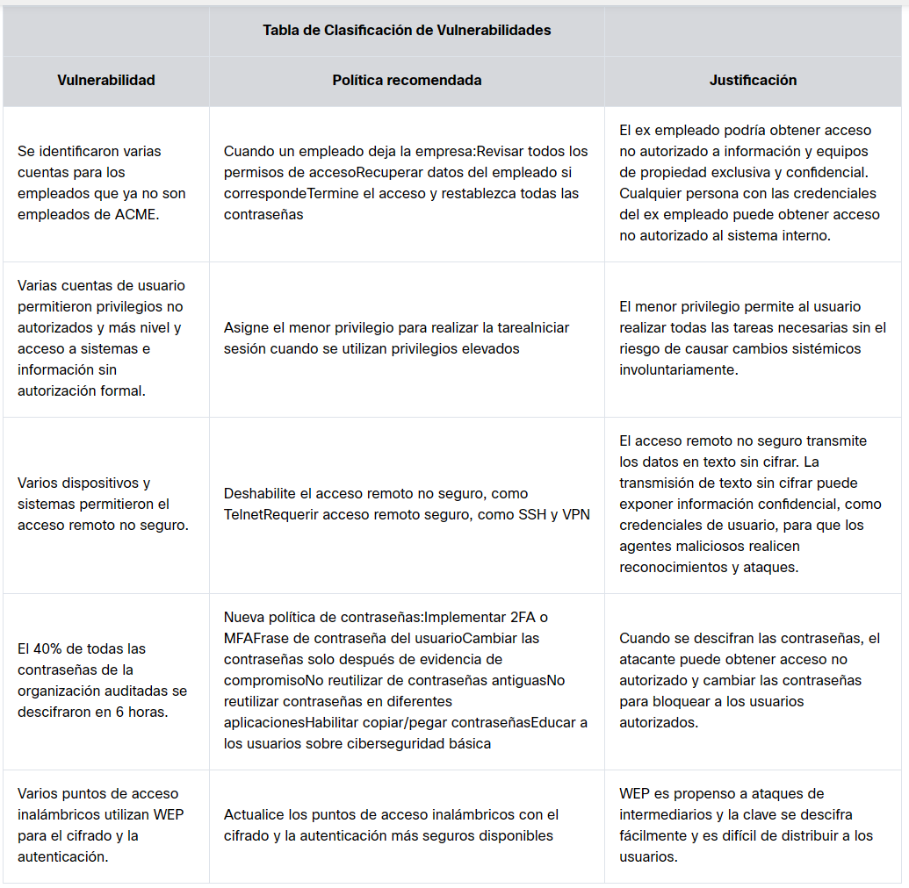
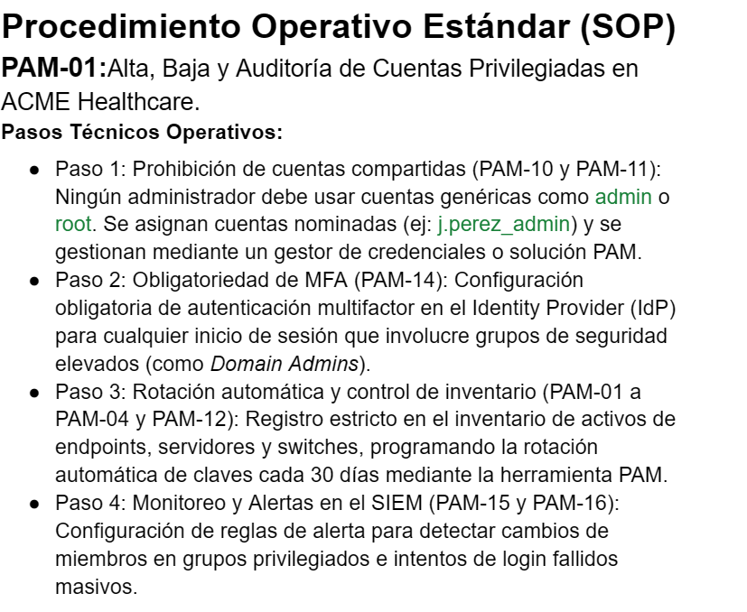

# 🛡️ Caso de Estudio: Gobernanza y Políticas de Seguridad - ACME Healthcare

Documentación técnica y de cumplimiento normativo desarrollada como parte de la simulación de mitigación de riesgos para **ACME Healthcare**.

---

## 📋 1. Descripción del Escenario
**ACME Healthcare** es una organización de servicios de salud que administra más de 25 centros médicos. Tras sufrir múltiples brechas de seguridad en los últimos cinco años, el CISO contrató una auditoría externa de pruebas de penetración, la cual reveló **15 vulnerabilidades críticas** que afectaban la confidencialidad, integridad y disponibilidad de los datos de los pacientes.

---

## 📊 2. Triaje y Priorización de Riesgos (Parte 2)
Dado que los recursos son limitados, se realizó un proceso de triaje para priorizar los hallazgos más críticos que requerían acción inmediata para evitar un incidente mayor.

| Vulnerabilidad | Política recomendada | Justificación |
| :--- | :--- | :--- |
| **Cuentas huérfanas:** Empleados que ya no trabajan en la empresa mantenían acceso activo. | Revisión de permisos, recuperación de equipos, terminación inmediata de accesos y reseteo de credenciales. | Evita el acceso no autorizado de exempleados a sistemas internos y bases de datos confidenciales. |
| **Privilegios excesivos:** Cuentas de usuario con permisos elevados no autorizados formalmente. | Aplicación estricta del Principio de Menor Privilegio (PoLP) y requerir elevación temporal de sesiones. | Mitiga el riesgo de daños sistémicos involuntarios o movimientos laterales de un atacante. |
| **Acceso remoto no seguro:** Uso de protocolos sin cifrar (ej. Telnet). | Deshabilitar accesos no seguros y exigir el uso de protocolos cifrados (SSH, VPN). | Previene la intercepción de credenciales y el reconocimiento de red en texto plano. |
| **Contraseñas débiles:** El 40% de las contraseñas se descifraron en 6 horas sin vencimiento estandarizado. | Implementación de MFA, longitud/complejidad estricta, prohibición de reutilización y rotación periódica. | Bloquea ataques automatizados de fuerza bruta y compromiso de credenciales. |
| **Redes Wi-Fi obsoletas:** Puntos de acceso utilizando WEP para cifrado y autenticación. | Actualización de los APs con estándares de cifrado robustos (WPA3 / WPA2-Enterprise). | Elimina la vulnerabilidad a ataques de intermediarios (MitM) y descifrado trivial de claves. |

> **Evidencia - Tabla de Clasificación de Vulnerabilidades:**
> 

---

## 🔐 3. Desarrollo de Políticas y Procedimientos Técnicos (Parte 3)

Para abordar el problema crítico de los privilegios excesivos y la gestión de accesos, se redactó un **Procedimiento Operativo Estándar (SOP)** obligatorio para el plantel técnico de ACME Healthcare.

### Procedimiento Operativo Estándar (SOP-PAM-01)
**Título:** Alta, Baja y Auditoría de Cuentas Privilegiadas en ACME Healthcare.

**Pasos Técnicos Operativos:**
* **Paso 1: Prohibición de cuentas compartidas (PAM-10 y PAM-11):** Ningún administrador debe utilizar cuentas genéricas (como `admin` o `root`). Se asignan estrictamente cuentas nominadas individuales (ej: `j.perez_admin`) gestionadas a través de un sistema centralizado PAM.
* **Paso 2: Obligatoriedad de MFA (PAM-14):** Configuración obligatoria de autenticación multifactor en el Identity Provider (IdP) para cualquier inicio de sesión que involucre grupos de seguridad elevados (ej. *Domain Admins*).
* **Paso 3: Rotación automática y control de inventario (PAM-01 a PAM-04 y PAM-12):** Inventario unificado de endpoints, servidores y dispositivos de red, programando la rotación automática de claves mediante la herramienta PAM.
* **Paso 4: Monitoreo y Alertas en el SIEM (PAM-15 y PAM-16):** Configuración de reglas de alerta para la detección inmediata de cambios en la membresía de grupos privilegiados e intentos de inicio de sesión fallidos masivos.

> **Evidencia - Procedimiento Operativo Estándar:**
> 

---

## 📈 4. Plan de Implementación, Difusión y Evaluación (Parte 4)

Una política de ciberseguridad es inútil si los empleados no la conocen ni la comprenden. Para garantizar su adopción en los 25 centros médicos de ACME Healthcare, se estructuró el siguiente plan operativo:

* **Departamentos Involucrados:** 
  * *Tecnología y Redes:* Implementación técnica del sistema PAM y restricciones de firewall.
  * *Recursos Humanos:* Coordinación para la baja automática de cuentas ante la desvinculación de personal.
  * *Personal Médico y Administrativo:* Concientización sobre el uso de credenciales seguras e ingeniería social.
* **Eventos y Tareas de Difusión:**
  * Capacitación obligatoria de incorporación (*onboarding*) en ciberseguridad para todo el personal nuevo.
  * Talleres trimestrales de actualización sobre gestión de contraseñas y reporte de anomalías.
* **Evaluación de Conocimiento:**
  * Evaluaciones cortas anuales obligatorias basadas en roles para verificar la retención de las políticas.
  * Campañas de simulación de *phishing* para medir la eficacia de la concientización en campo.

---

## 💡 5. Conceptos Aprendidos y Habilidades Demostradas
* **Gobernanza y Cumplimiento (GRC):** Diferenciación y aplicación práctica entre Políticas, Estándares, Guías y Procedimientos.
* **Gestión de Accesos Privilegiados (PAM):** Comprensión de los riesgos asociados a cuentas huérfanas y privilegios excesivos.
* **Mentalidad Defensiva (Blue Team):** Capacidad de traducir vulnerabilidades técnicas de una auditoría en contramedidas organizacionales efectivas.

---
*Caso documentado bajo estándares profesionales para portfolio de ciberseguridad.*
